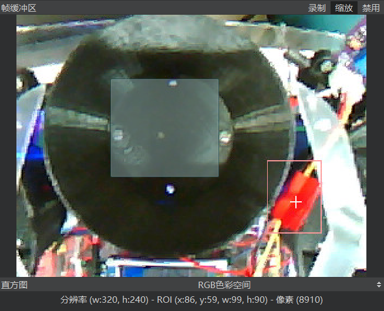
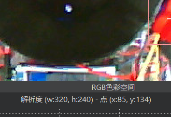
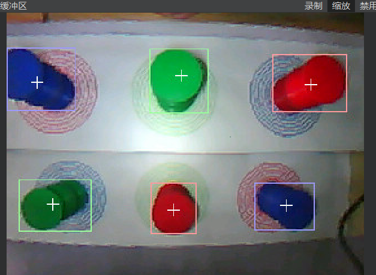

# CUEIPC-VisionRecognitionIntroduction

CUEIPC-LogisticsVehicleAI is a vision recognition system designed for the "China College Students Engineering Innovation and Practice Competition" - Logistics Vehicle Track. The OpenMV H7 Plus is used as the edge computing device.

This program is theoretically also suitable for other devices compatible with the [OpenMV API](https://book.openmv.cc/). You can also choose [official devices](https://openmv.io/collections/all-products) or third-party OpenMV. **The API used in this project is unrelated to OpenCV.**

Note that the program includes some examples or deprecated functions. Some variable names may not necessarily correspond to their actual meanings; some are just for fun or easy to remember. You can change them to more appropriate variable names as needed.

Mode Description
----------------

* C-Code-Transfer color order array
* F-?-Old disc recognition program
* R-?-Second disc recognition program
* S-Sha-New disc recognition program
* B-Bi-Second new disc recognition program
  * Note: The disc recognition program will execute the exact same program, but the mode selection program will assign the global variable "Round" with values of 1 and 2 to control the reference order of servo command transmission.
* D-?【Deprecated】Free shooting
* T-Transform-【Final】Recognize and transfer step color
* I-Identify-【Debug】Disc threshold display
* N-Navigation-【Deprecated】Navigation mode
* X-?-【Final】【Pending】Material grabbing mode
* Y-?-【Final】Disc shooting
* G-Gou-Color recognition of the second area
* H-Hao-Disc shooting

## Terminology

### Image Object

To use OpenMV for image detection is to operate on the image. Whether it's finding color blocks or circles, it's a method of operating on color blocks.

Define an image object:

```text-x-python
img=sensor.snapshot().lens_corr(1.8)
```

By taking a snapshot of the sensor object (sensor) and setting the wide-angle distortion parameter to 1.8 (lens_corr), we get an image object img.

More methods of obtaining images can refer to the transcription website.

### Serial Port Object

The definition method of the serial port object (in OpenMV) is:

```text-x-python
？=UART（serial port number, baud rate）
```

You can use the write method to send. For example:

```text-x-python
uart.write(str(age))
```

### Region of Interest

That is ROI. An ROI consists of an array of four data, namely: [upper left corner x coordinate, upper left corner y coordinate, width, height].

### Color Block Object

There are no methods for color blocks, but it has some attributes.

*~represents the object name

* ~.cx() The x coordinate of the center point
* ~.cy() The y coordinate of the center point
* ~.x() The x coordinate of the upper left corner point
* ~.y() The y coordinate of the upper left corner point
* ~.w() Length
* ~.h() Height
* ~.pixels() Number of pixels

### Obtaining Color Blocks

Key command: img.find\_blobs. This is an operation on the image object. Find color blocks that meet the threshold from the image object. Syntax:

image.find\_blobs(thresholds, roi=Auto, x\_stride=2, y\_stride=1, invert=False, area\_threshold=10, pixels\_threshold=10, merge=False, margin=0, threshold\_cb=None, merge\_cb=None) In addition to the Thresholds (threshold) parameter, other parameters that need to be added with an equal sign can be switched at will. If not used, it can be omitted. Some of the main parameters are:

* roi indicates the region of interest
* area\_threshold indicates the minimum area threshold
* pixels threshold indicates the pixel threshold
* merge indicates whether to merge color blocks (default is yes)

### Circle Object

There are no methods for circle objects. But there are some attributes.

* x() The x coordinate of the center point
* y() The y coordinate of the center point
* r() Radius

Global Variable Description
---------------------------

### General Program

Note that the variables of the general program will be accessed and stored by multiple functions, **make sure the function you need to store is read and saved immediately after storage, to avoid overlay problems**.

* Blob State Temp is generated by TBlobState/UniBlobState. Pass the color object array of the general color collection program.
* Color Position Temp is generated by TColorPosition. Pass the color object array of the general sorting program.

### Color Threshold

blue, red, green correspond to the thresholds of blue, red, and green colors.

This threshold will affect **the threshold of the preliminary competition disc recognition and the final competition step recognition**.

You can consider this as the threshold of the material. When the material is needed, call the color threshold variable or the single variable here.

### Positioning Disc Threshold

* Detect Threshold Disc threshold, the larger the recognition is more demanding.
* RMIN-Minimum radius value
* RMAX-Maximum radius value
* XStart-The starting position based on the X-axis coordinate of the disc center (less than the left)
* XEnd-The end position based on the X-axis coordinate of the disc center (less than the right)

This threshold will affect the N-navigation mode, Y-final disc shooting program.

### Other Thresholds

* pixels threshold Pixel threshold: the minimum pixel for recognizing color blocks.
* area threshold Area threshold: the minimum size for recognizing color blocks.

These two thresholds will affect the threshold of the preliminary competition disc recognition and the final competition step recognition.

* Move Threshold Movement threshold: the threshold for determining whether the color block in the picture has moved.
* Stop Threshold Stop threshold: the threshold for determining whether the color block in the picture has stopped.

These two thresholds will affect all functions that need to determine movement. For example, S, B-Preliminary competition disc clamping, Y-Final competition disc shooting.

* color threshold: An array. The three color thresholds are packaged into an array in the order of red, green, and blue for easy traversal.

### Finals

* CV Shoot Mode: Final disc shooting mode
* Six color blocks
  * roiUp Divides the upper part of the screen into a cut-out box (upper layer)
  * roiDown Divides the lower part of the screen into a cut-out box (lower layer)
  * Color Position Up The color order of the upper layer
    * Preset to 0-1-2
  * Color Position Down The color order of the lower layer
    * Preset to 2-1-0
  * Blob State Up Stores the color object of the upper position
  * Blob State Down Stores the color object of the lower position
  * FTH01 Locates the X-axis boundary of position 1, 2 (index 0, 1)
  * FTH02 Locates the X-axis boundary of position 2, 3 (index 1, 2)

roi refers to the region of interest. Move the mouse to the "frame buffer" in the upper right corner, select some images, and the prompt below will automatically appear with the four parameters of roi: the x and y coordinates of the upper left corner, width, and length.



If you don't select, just click, you can determine the x and y coordinates of the click position, and thus determine the value of FTH01, FTH02.



* Disc
  * roi FF Locates the ROI area of the previous target
  * roi BB Locates the ROI area of the next target
  * Blob State FF Stores the color object of the previous target
  * Blob State BB Stores the color object of the next target
  * Blob State Empty Stores the color object used to detect whether there is material
  * Circle State Stores the circle object used to determine whether it is stationary
  * Target Blue Blue target threshold
  * Target Red Red target threshold
  * Target Green Green target threshold
  * Target Thresholds Integrates the color thresholds in the order of red, green, and blue for easy traversal.
  * Target Pix Target pixel threshold
  * Target Area Target area threshold
  * Empty Pix Detects whether there is material pixel threshold
  * Empty Area Detects whether there is material area threshold
  * Miss Count Counts the number of discarded rounds

roi refers to the region of interest. Move the mouse to the "frame buffer" in the upper right corner, select some images, and the prompt below will automatically appear with the four parameters of roi: the x and y coordinates of the upper left corner, width, and length.



If you don't select, just click, you can determine the x and y coordinates of the click position, and thus determine the value of FTH01, FTH02.

* Disc
  * roi FF Locates the ROI area of the previous target
  * roi BB Locates the ROI area of the next target
  * Blob State FF Stores the color object of
