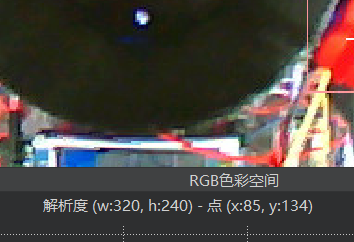

# **CUEIPC-VisionRecognition**

## 简介

CUEIPC-LogisticsVehicleAI 是一个为《中国大学生工程创新与实践大赛》-物流车赛道设计的视觉识别系统。使用OpenMV H7 Plus作为边缘计算设备。

该程序理论上也适用于其他兼容[OpenMV API](https://book.openmv.cc/)的设备。你也可以选用[官方设备](https://openmv.io/collections/all-products)或者是第三方的OpenMV。**此项目所使用的API与OpenCV无关。**

注意，程序内部包含一些范例或是已废弃的功能。一些变量名和实际意义不一定有对应关系，有些只是为了好玩/好记。你可以自行更换为更合适的变量名。

模式说明
--------

* C-Code-传输颜色顺序数组
* F-？-旧版圆盘识别程序
* R-？-第二次圆盘识别程序
* S-Sha-新版圆盘识别程序
* B-Bi-第二次新版圆盘识别程序
  * 注：圆盘识别程序将执行完全相同的程序，但模式选择程序将会赋全局变量“Round”以1、2两种值来控制舵机指令传输的参考顺序。
* D-？【废弃】自由打靶
* T-Transform-【决赛】识别并传输台阶颜色
* I-Identify-【调试】圆阈值显示器
* N-Navigation-【废弃】导航模式
* X-？-【决赛】【待定】物料抓取模式
* Y-？-【决赛】圆盘打靶
* G-Gou-二号区域颜色识别
* H-Hao-圆盘打靶

## 名词说明

### 图片对象

要使用OpenMV进行图像检测，就是对图像进行操作。无论是寻找色块还是圆，都是对色块的操作方法。

定义一个图像对象：

```text-x-python
img=sensor.snapshot().lens_corr(1.8)
```

通过对传感器对象（sensor）进行拍摄（snapshot）方法，并设定广角畸变参数为1.8（lens\_corr），我们得到了一个图片对象img。

更多获取图像的方法可以参考转录网站。

### 串口对象

串口对象的定义方法（在OpenMV中）为：

```text-x-python
？=UART（串口编号，波特率）
```

你可以使用write方法发送。比如：

```text-x-python
uart.write(str(age))
```

### 感兴趣区域

即ROI。一个ROI由四个数据的数组组成，分别为：\[左上角x坐标、左上角y坐标、宽、高\]。

### 色块对象

色块没有什么方法，但它有一些属性。

\*~代表对象名

* ~.cx() 中心点x坐标
* ~.cy() 中心点y坐标
* ~.x()左上角点x坐标
* ~.y()左上角点y坐标
* ~.w()长度
* ~.h()高度
* ~.pixels() 像素数

### 获取色块

关键指令：img.find\_blobs。这是对图片对象进行的操作。从图片对象中找出符合阈值的色块。语法：

image.find\_blobs(thresholds, roi=Auto, x\_stride=2, y\_stride=1, invert=False, area\_threshold=10, pixels\_threshold=10, merge=False, margin=0, threshold\_cb=None, merge\_cb=None)除了Thresholds（阈值）参数外，其他需要加等号的参数可以随意切换顺序。不使用可不加。其中一些主要的参数：

* roi表示感兴趣区域
* area\_threshold表示最小区域阈值
* pixels threshold表示像素阈值
* merge表示是否合并色块（默认为是）

### 圆对象

圆对象也没什么方法。但有一些属性。

* x() 中心点x坐标
* y() 中心点y坐标
* r() 半径

全局变量说明
------------

### 通用程序

注意，通用程序的变量将会由多个函数进行存取，**确保你需要的函数存入后立刻读取保存，以免发生覆盖问题**。

* Blob State Temp 由TBlobState/UniBlobState产生。传递通用颜色采集程序的颜色对象数组。
* Color Position Temp 由TColorPosition产生。传递通用排序程序的颜色对象数组。

### 颜色阈值

blue、red、green对应蓝、红、绿三种颜色的阈值。

该阈值会影响到**初赛圆盘识别与决赛台阶识别的阈值**。

你可以认为这是物料的阈值。需要用到物料时，调用color threshold变量或这里的单个变量。

### 定位圆阈值

* Detect Threshold 圆阈值，越大识别越苛刻。
* RMIN-半径最小值
* RMAX-半径最大值
* XStart-圆心X轴坐标为准的起始位置（小于则偏左）
* XEnd-圆心X轴坐标为准的结束位置（小于则偏右）

该阈值会影响N-导航模式、Y-决赛圆盘打靶程序。

### 其他阈值

* pixels threshold 像素阈值：识别色块的最小像素。
* area threshold 区域阈值：识别色块的最小大小。

这两个阈值会影响到初赛圆盘识别与决赛台阶识别的阈值。

* Move Threshold 移动阈值：判断画面内色块是否移动的阈值。
* Stop Threshold 停止阈值：判断画面内色块是否停止的阈值。

这两个阈值会影响所有需要判断移动的功能。比如S、B-初赛圆盘夹取、Y-决赛圆盘打靶。

* color threshold：一个数组。将三种颜色阈值按照红绿蓝的顺序封装到一个数组中，方便进行遍历。

### 决赛

* CV Shoot Mode：决赛圆盘打靶模式
* 六色块
  * roiUp 平分画面上侧的截框（上层）
  * roiDown 平分画面下侧的截框（下层）
  * Color Position Up 上层的颜色顺序
    * 预设为0-1-2
  * Color Position Down 下层的颜色顺序
    * 预设为2-1-0
  * Blob State Up 储存上层位置的颜色对象
  * Blob State Down 储存下层位置的颜色对象
  * FTH01 定位1、2（下标0、1）位置的X轴分界线
  * FTH02 定位2、3、（下标1、2）位置的X轴分界线

roi指的是感兴趣区域。将鼠标移动到右上方的“帧缓冲区”，框选一些图像，下方提示会自动出现roi的四个参数：左上角x、左上角y、宽度、长度。


不框选，只进行点击，可以确定点击位置的x、y坐标，以此来确定FTH01、FTH02的值。



* 圆盘
  * roi FF 定位前一个靶的ROI区域
  * roi BB 定位后一个靶的ROI区域
  * Blob State FF 储存前一个靶的颜色对象
  * Blob State BB 储存后一个靶的颜色对象
  * Blob State Empty 储存用于检测是否有物料的颜色对象
  * Circle State 储存用于判断是否静止的圆对象
  * Target Blue 蓝色靶阈值
  * Target Red 红色靶阈值
  * Target Green 绿色靶阈值
  * Target Thresholds 把颜色阈值按照红、绿、蓝的顺序进行整合，方便遍历。
  * Target Pix靶像素的阈值
  * Target Area靶面积阈值
  * Empty Pix检测是否有物料的像素阈值
  * Empty Area检测是否有物流的面积阈值
  * Miss Count 计算丢弃轮数
* 第二区域识别
  * AREA2COLOR 要传输的3个区域的颜色
  * roiSAD1 第一区域的ROI
  * roiSAD2 第二区域的ROI
  * roiSAD3 第三区域的ROI
  * SADpix 色块识别靶的特殊像素阈值参数
  * SADarea 色块识别靶的特殊区域阈值参数

### 公共变量

* Color Code 1传输得到的第一组颜色代码
  * 预设：0-1-2（红-绿-蓝）
* Color Code 2传输得到的第二组颜色代码
  * 预设：2-1-0（蓝-绿-红）
* Blob State储存颜色对象用
* Blob State Low 储存低位置颜色对象用
  * 储存的包括旧版圆盘识别的低位置、以及决赛圆盘打靶的正位
* Color Position 用于储存每个颜色的位置，新版识别用
* XTH01 新版圆盘识别中，定位01位置分界线（三分的左分线）的X坐标
* XTH21 新版圆盘识别中，定位12位置分界线（三分的右分线）的X坐标
* Round 当前轮数

通用函数说明
------------

### Camera Startup

函数以QVGA模式启动摄像头。该模式下，默认分辨率为320\*240。

初始化摄像头的分辨率会影响计算的帧率和坐标值。

set\_windowing方法将会为分辨率下指定一个全局ROI。范围之外的像素不进行拍摄。使用比分辨率小的ROI可以在保证图像高清的同时不降低帧率（当然会牺牲范围）

### Pika Transform

将接收到的任意字符进行打印

### Camera Startup HD

以HD(VGA)方式启动摄像头，但划定一个固定区域

### Camera Startup HD Free

以HD（VGA）方式启动摄像头，不规定区域

### Check Motion/Stop Static

根据X轴坐标判断是否移动。

### T Blob State

通用型颜色采集程序。括号内传入ROI感兴趣区域。输出区域内的颜色对象数组并储存在BlobStateTemp。

原理见“获取色块”

获取颜色对象的基础程序方法。拍摄一张照片并储存到BlobState数组内。

经过该程序，储存的数组结构如下：

BlobState\[颜色序号\]\[同时被检测到的颜色块编号\]

* 颜色序号：0、1、2分别对应红、绿、蓝
* 同时被检测到的颜色块编号：当画面中出现不互相连接的色块后，将会进行分开储存。

BlobState\[0\]\[0\]就是红色第一个色块的颜色对象。

示例：

```text-x-python
roi=[0,0,20,20]
TBlobState(roi)
```

### Uni Blob State

通用型颜色采集程序。

括号内传入两个参数：1. 参考的颜色阈值数组（可自拟，格式按照color\_threshold或TargetThresholds）2.感兴趣区域。

程序面向需要自定义阈值的情况。

注意：该函数产生的颜色对象也会存至BlobStateTemp中。

示例：

```text-x-python
CustomBlue = (0, 59, 2, 56, -76, -20)#蓝色
CustomRed = (56, 70, 6, 127, -2, 30)#红色
CustomGreen = (62, 71, -33, -10, 11, 20)#绿色
CustomThreshold = [[CustomRed],[CustomGreen],[CustomBlue]]
roi=[0,0,20,20]
UniBlobState(CustomThreshold,roi)
```

### T Color Position

通用型颜色位置寻找程序。括号内传入由Get Blob State类程序产生的数组，如BlobStateTemp、BlobState、BlobStateUp等。

根据BlobState中各个颜色的中心cx坐标和两个全局变量：XTH01、XTH12来判断各个颜色分别在哪个区域。其中XTH01和XTH12就是屏幕三分点的左点和右点。

输出为红、绿、蓝三种颜色的对应位置（0、1、2），储存在全局变量ColorPositionTemp中。

示例：

```text-x-python
roi=[0,0,20,20]
TBlobState(roi)
TColorPosition(BlobStateTemp)
```

### T Transform

通用型位置码转换程序。把ColorPosition型程序输出的Color Position数组的形式转换成颜色（下标）-位置（内容）的形式。

这是一个有返回值的程序。使用方法：

```text-x-python
转换完的数组=TTransform(需要转换的数组）
```

示例：

```text-x-python
roi=[0,0,20,20]
TBlobState(roi)
TColorPosition(BlobStateTemp)
PositionGroup=TTransform(ColorPositionTemp)
```

### T Send Code

通用型发送程序。

从括号内传入需要发送的数组/字符串，一股脑全部送出去。

示例：

```text-x-python
#演示了从获取颜色、获取位置、转换位置码到发送的完整流程
roi=[0,0,20,20]
TBlobState(roi)
TColorPosition(BlobStateTemp)
PositionGroup=TTransform(ColorPositionTemp)
TSendCode(PositionGroup)
```

专有函数说明
------------

### Final Second Area Detect

第二区域颜色识别程序。

BlobStateSAD1~3分别储存三个区域的颜色对象。为了识别圆环，摄像头需要以HD模式启动。

首先摄像头将会拍摄三次，并获取三个区域的颜色。当没有颜色获取到时，会循环进行获取，直到获得颜色。

随后根据获取的颜色对象是否存在，判断三个区域到底时什么颜色的圆环。

### Final Color Detect


决赛，识别台阶颜色

1. 获得上层颜色
2. 根据获得的上层颜色进行排序
3. 获得下层颜色
4. 根据获得的下层颜色进行排序
5. 发送识别到的台阶颜色

### Send Code

发送台阶识别内容

其中，通过遍历对ColorPosition的下标和内容进行反转，然后写入codetemp数组中。

### Final CV Capture

备用程序。功能是已废弃。

### Color Threshold

阈值显示器程序，默认会在没收到任何指令或者程序结束后运行。可以使用彩色线框显示识别到的颜色。

画框使用了draw\_rectangle方法。color参数为RGB。

串口读到任何字符后，程序将会退出。重启OpenMV即可在任何状态下进入该程序。

### Get Code

接收来自串口的6位颜色顺序信息。储存到ColorCode1和ColorCode2中。

重复运行将会覆盖。允许主机端执行完初赛后立刻执行决赛。

### Get Blob State

全屏获取颜色区域。

原理见“获取色块”

获取颜色对象的基础程序方法。拍摄一张照片并储存到BlobState数组内。

经过该程序，储存的数组结构如下：

BlobState\[颜色序号\]\[同时被检测到的颜色块编号\]

* 颜色序号：0、1、2分别对应红、绿、蓝
* 同时被检测到的颜色块编号：当画面中出现不互相连接的色块后，将会进行分开储存。

BlobState\[0\]\[0\]就是红色第一个色块的颜色对象。

Get Blob State有以下功能卵生，主要和ROI区域有关。

#### Get Blob State Low

检测低位置（圆盘中最靠近车的那个）物块颜色

#### Get Blob State Up

检测台阶上颜色

#### Get Blob State Down

检测台阶下颜色

#### Get Blob State FF

决赛中，检测前一个圆盘靶的程序

#### Get Blob State BB

决赛中，检测后一个圆盘靶的程序

#### Get Blob Empty

决赛中，检测圆盘靶是否为空的程序

### Final If Stop/Move

决赛中判断画面是否移动/静止的程序。依赖于圆盘识别程序Get Circle State。

使用此格式来使用：

```text-x-python
while FinalIfStop():
	continue
while FinalIfMove():
	continue
```

以此判断圆盘是否可以夹取

### Check Disk Position

旧版检测圆盘是否移动的程序。

已经失效。

### Get Disk

旧版拿取单个的程序

已经失效。

### Get Disk New

现在所使用的圆盘夹取程序。逻辑如下：

首先，根据全局变量（会在传入模式选择时改变）Round判断需要参考的顺序组Color Reference。

进入夹取三次的程序。每一次首先检测是否可以夹取。随后调用GetBlobState()更新画面颜色对象，然后使用GetColorPosition()程序针对各个颜色对象的x坐标判断其位置所在。随后根据颜色位置与参考顺序指挥主机夹取对应位置的色块，然后隔一段时间后再次根据参考顺序放置色块。

### CVDisk

旧版程序

### CV Disk New

调用Get Disk New。

### Circle Thresholds

查看圆阈值是否合适的程序

### Get Circle State

获取圆对象。

### Navigation

根据圆对象的位置，判断是否偏左或偏右。视觉引导定位。

更改全局变量中的Xstart和Xend可以改变定位为准时画面内圆心位置。

程序将会在认为需要向左移动时向主机发送L，需要向右移动时发送R。认为准超过3次（大约0.3秒）后，会发送E并退出程序。

### Final CV Shooting

预想中的圆盘打靶程序

### Get Color Position

根据BlobState中各个颜色的中心cx坐标和两个全局变量：XTH01、XTH12来判断各个颜色分别在哪个区域。其中XTH01和XTH12就是屏幕三分点的左点和右点。

该功能根据需要判断的颜色对象数组还有以下孪生：

#### Get Color Position Up

获取台阶上层颜色顺序

#### Get Color Position Down

获取台阶下层颜色顺序

### CV Shooting

视觉打靶

会在结束时发送1-打靶/0-丢弃

丢弃计数取全局变量Miss Count
